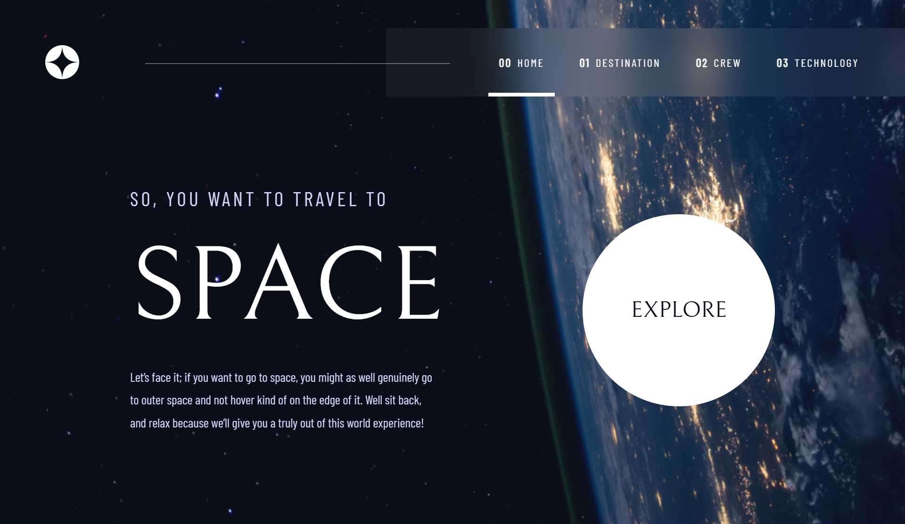

<h1 style="text-align: center;">Space Tourism</h1>

This project is a challenge from [Frontend Mentor](https://www.frontendmentor.io/). Is a multi-page website with static information.

## Build with

- [Angular (CLI 18.2.0)](https://angular.dev)
- [SASS](https://sass-lang.com)

## Features

- Server Side Rendering
- Prerendering (Static Site Generation)
- Route transition animations
- Signals

---

## Checkout Final Website

[Visit Space Tourism Website](https://spacetourismscp.netlify.app/)

---

## Local Development and Quickstart

### Prerequisites

- Install [Node.js](https://nodejs.org)
- You can install [Angular CLI](https://angular.dev) via npm with `npm install -g @angular/cli@18.2.0`
- Clone this repo `git clone https://github.com/SergioCzPz/space-tourism.git`
- In the terminal, enter to the path of the folder where the **space tourism** project is, once there, you can install all the dependencies via `npm` with `npm install`
- Finally, you can devolope the project with `ng serve` or you can build the project with `ng build`

---

## To do

- Create testing for this application
- **Bug Fix:** The state of the main menu once initialize

---

## Contributions

I'd love to receive your contributions, be it code fixes, new features, bug reports, discussions, or anything else that can help me.

If you would like to contribute a fix for an issue, please comment on the issue indicating that you want to fix it so that we can assign it to you and track the status on our end. If the issue does not exist, create it first or ask that an existing discussion be promoted to an issue.
